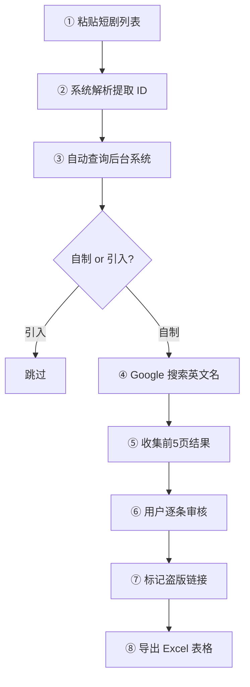

# 短剧盗版内容检测工具 — 产品需求文档 (PRD)

> **版本**: v1.1 (已确认细节)
> **最后更新**: 2026-04-03

---

## 1. 背景与目标

### 1.1 背景

运营人员每天需手动完成以下流程来检测短剧盗版内容：

1. 从短剧列表中获取短剧 ID（约 50 部/天）
2. 在后台系统中查询该短剧的详细信息（名称、中文名、CP、自制/引入）
3. 筛选出 **自制短剧**（引入短剧跳过）
4. 复制短剧 **英文名称**，在 Google 搜索前 5 页
5. 人工判断是否为盗版链接，记录到表格中

**痛点**：重复性高、耗时长、容易遗漏。

### 1.2 目标

构建一个 **本地运行的 Web 工具**，自动化上述流程的搜索与收集环节，用户只需做最终的人工判断。

---

## 2. 已确认的技术约束

| 约束项 | 确认结果 |
|--------|---------|
| 后台系统 | `https://hwadmin.ikyuedu.com/glory-admin/content/`，无 API，需浏览器自动化 |
| 后台登录 | 用户手动登录，session 持久化，无需频繁登录 |
| 后台查询方式 | 在"短剧ID"搜索框输入 ID → 点击搜索 → 表格展示结果 |
| 自制/引入判断 | 原始片库页面表格中直接可见"自制引入"列 |
| 国内翻译/海外原创 | 需点击 "编辑" → "标记" tab 查看 |
| Google 搜索 | 免费方案，Playwright 模拟浏览器搜索 |
| 每日处理量 | ~50 部短剧 |
| 部署方式 | 本地运行 |
| 开发策略 | 分阶段，MVP 先做核心搜索+记录 |

---

## 3. 核心功能模块

### 3.1 短剧列表导入

- **输入方式**：粘贴 `名称(ID)` 格式的文本列表
- **解析规则**：自动提取括号中的 ID（支持 `42000007456`、`41000105764` 等格式）
- **展示**：解析后列出所有短剧及其 ID，显示导入数量

### 3.2 后台信息自动查询

**操作流程（Playwright 自动化）：**

1. 打开后台页面（用户已登录，session 有效）
2. 在"短剧ID"输入框中填入 ID
3. 点击"搜索"按钮
4. 从结果表格中提取：
   - **短剧名称**（英文/原名）
   - **中文名称**（从输入列表中已有）
   - **CP 名称**
   - **自制/引入**（直接从表格读取）
5. 若为**自制**，继续进入编辑 → 标记页，提取 **国内翻译/海外原创** 标记
6. 若为**引入**，标记跳过

**异常处理**：
- ID 查无结果 → 标记为"未找到"
- 登录过期 → 暂停并提示用户重新登录

### 3.3 Google 搜索与结果收集

**搜索流程（Playwright 自动化）：**

1. 在 Google 中搜索短剧英文名称
2. 抓取前 5 页搜索结果，每条提取：URL、标题、摘要
3. 翻页并重复，直至 5 页完成或无更多结果

**反爬策略：**
- 每次搜索间隔 5-15 秒随机延时
- 使用真实浏览器指纹（Playwright chromium）
- 遇到验证码时暂停，弹窗提示用户手动完成验证
- 50 部短剧预计总耗时约 30-60 分钟（可后台运行）

### 3.4 搜索结果人工审核

- 以列表形式展示每部短剧的搜索结果
- 每条结果显示：标题、URL、摘要
- 用户可点击 **标记为盗版** 或 **忽略**
- 支持一键在新窗口打开链接查看详情

### 3.5 结果导出

**导出表格字段（对齐现有工作表）：**

| 字段 | 来源 |
|------|------|
| 日期 | 检测日期，自动生成 |
| 盗版平台 | 从 URL 中提取域名 |
| 剧集 ID | 导入的短剧 ID |
| 剧名 | 后台查询的英文名称 |
| 中文剧名 | 后台查询的中文名称 |
| 剧集 CP | 后台查询的 CP 名称 |
| 侵权链接 | 用户标记的盗版 URL |
| 完成人姓名 | 用户填写（可设置默认值） |
| 国内翻译 or 海外自制 | 后台标记页提取 |

**导出格式**：`.xlsx`（兼容现有工作流）

---

## 4. 用户操作流程

---

## 5. 页面结构（MVP）

### 5.1 主页 — 任务面板

- 新建检测任务按钮
- 粘贴短剧列表的文本框
- 启动检测按钮
- 进度展示（已查询 / 已搜索 / 总数）

### 5.2 任务进度页

- 短剧列表表格，含状态列（待查询 → 已查询 → 搜索中 → 已完成 → 已跳过）
- 实时进度条
- 暂停/继续/取消按钮
- 验证码弹窗提示（Google 反爬触发时）

### 5.3 结果审核页

- 左侧：短剧列表（自制的）
- 右侧：选中短剧的搜索结果列表
- 每条结果：标题 + URL + 摘要 + 标记按钮
- 已标记盗版的结果高亮显示

### 5.4 导出页

- 预览已标记的盗版记录表格
- 填写完成人姓名（记住上次输入）
- 一键导出 Excel

---

## 6. 技术架构

| 层级 | 技术选型 | 说明 |
|------|---------|------|
| 前端 | Next.js + React | 本地 Web 应用 |
| 后端 | Next.js API Routes | 控制 Playwright、数据处理 |
| 浏览器自动化 | Playwright | 后台查询 + Google 搜索 |
| 数据存储 | SQLite | 本地轻量级存储任务和结果 |
| 文件导出 | SheetJS (xlsx) | 生成 Excel 文件 |

---

## 7. 开发阶段规划

### Phase 1 — MVP（核心搜索+记录）

> 目标：替代手动 Google 搜索和记录，节省 70% 以上时间

- [x] 短剧列表粘贴导入与解析
- [x] Playwright 自动查询后台系统
- [x] 自动过滤引入短剧
- [x] Playwright 自动 Google 搜索前 5 页
- [x] 搜索结果展示与人工标记
- [x] 导出 Excel 表格

### Phase 2 — 智能识别

- [ ] 域名黑名单/白名单管理
- [ ] 关键词匹配引擎
- [ ] 自动预标记高风险链接
- [ ] 批量操作（全选标记等）

### Phase 3 — 增强

- [ ] 历史任务记录与查看
- [ ] 统计面板（趋势图、平台分布）
- [ ] AI 辅助判断（LLM 分析链接内容）
